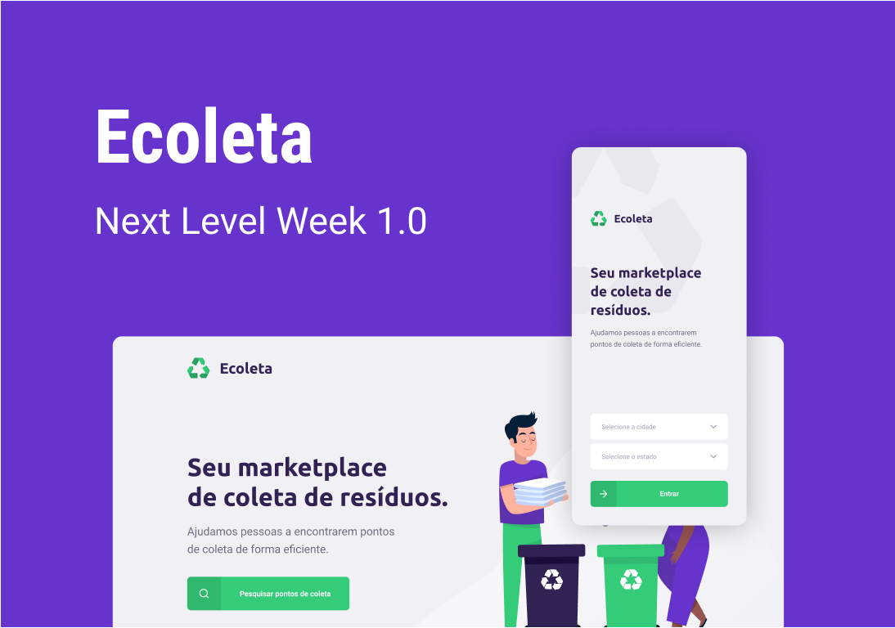
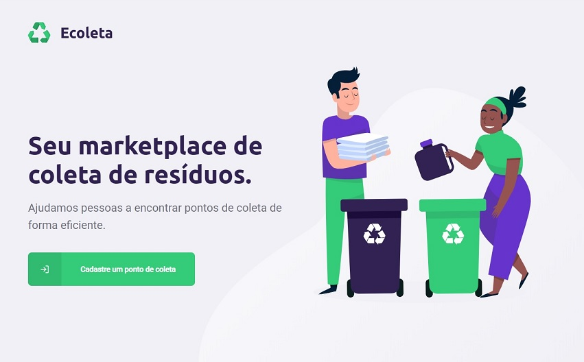

# ECOLETA - Waste Recycling Collection Marketplace

Marketplace to join customer interested in recycling your's waste and company that collect this kind of material. We avaible web app to register collect points by company, and a mobile app for customers to pick up the collection point closest to where they are.

> This project is the result of studies acquired at **Next Level Week # 01** available by the company **Rocketseat**. 

# Screenshots

##### 🌐 App Web




##### 📱 App Mobile

<div style="display: flex; justify-content: space-between;">
  
  
  
</div>

# Project structure

This is a fullstack project and is divide in three parts: [server](server), [app web](web) and [app mobile](mobile).

## 🛠️ Technologies

These are the technologies used throughout the project:

-  [Node.js][nodejs]
-  [ReactJS](https://reactjs.org/)
-  [ReactNative](https://reactnative.dev/)
-  [Expo](https://expo.io/learn)
-  [TypeScript](https://www.typescriptlang.org/)
-  [React Navigation](https://reactnavigation.org/)
-  [Axios](https://github.com/axios/axios)
-  [Knex](http://knexjs.org/#knexfile)

# How to install and run

## 📌 Prerequisites

You need install:

- [Node.js][nodejs] (prefer version 12.17.0 or higher)
- [Expo CLI][expocli] for manager package from Expo
- [Yarn][yarn] (prefer version 1.21.1 or higher)

Clone this repository:

```bash
# Clone this repository
$ git clone https://github.com/deividr/nlw-01

# Go into the repository
$ cd nlw-01
```

## 🖥️ Server Side

Install process:

```bash
# Go into the folder server
$ cd server

# Install package's
$ yarn install

# Go to into the folder database configuration
$ cd src/database

# Executes migrations with knex
$ yarn knex:migrate

# Insert datas execute seeds
$ yarn knex:seed
```

Run process:

```bash
# Run with ts-node-dev for watch modify files and restart server
$ yarn dev
```

## 🌐 App Web

> 🏷️ Server needs to be running

Install process:

```bash
# Go into the folder web
$ cd web

# Install package's
$ yarn install
```

Run process:

```bash
$ yarn start
```

## 📱 App Mobile

> 🏷️ Server needs to be running

Install process:

```bash
# Go into the folder mobile
$ cd mobile

# Install package's
$ yarn install
```

Run process:

```bash
$ yarn start
```

# 📥 Improvements

##### 🖥️ Server Side

- Not allow the upload of files other than images

##### 📱 App Mobile

- Includes selector field to Federal Unity
- Includes selector field to City
- Integration with the IBGE API for get Federal Unity and City

# 📝 License

This project is under the MIT license. See the [LICENSE](LICENSE) for more information.

[nodejs]: https://nodejs.org/
[expocli]: https://docs.expo.io/get-started/installation/
[yarn]: https://yarnpkg.com/
[vc]: https://code.visualstudio.com/
[vceditconfig]: https://marketplace.visualstudio.com/items?itemName=EditorConfig.EditorConfig
[vceslint]: https://marketplace.visualstudio.com/items?itemName=dbaeumer.vscode-eslint

---

For more about [me:crown:](https://www.linkedin.com/in/deivid-assump%C3%A7%C3%A3o-rodrigues-a36a5685/).
